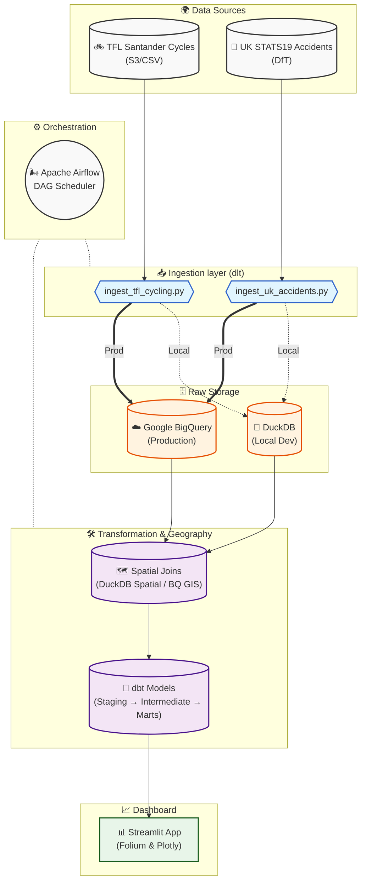
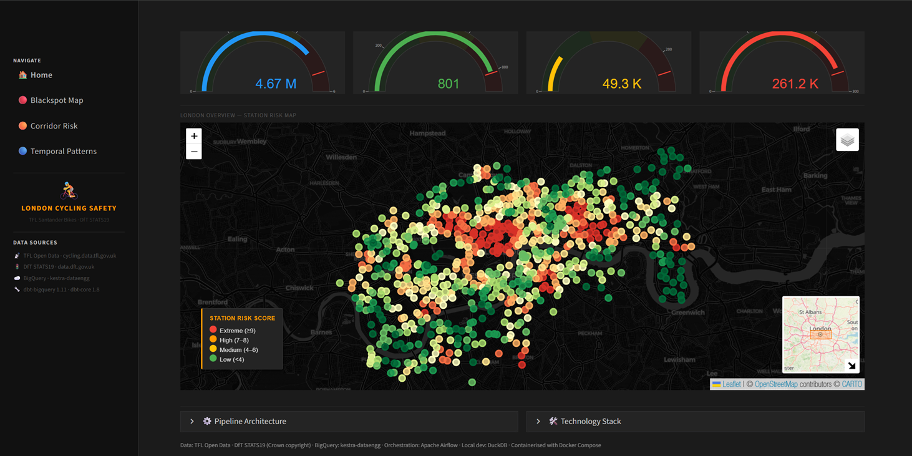

# London Cycling Safety Corridor Analysis

An end-to-end data engineering project that identifies the most dangerous cycling corridors in London by combining TFL Santander Cycle Hire journey data with UK government road accident statistics (STATS19). The pipeline is fully reproducible: clone → configure → run.

---

## Table of Contents

1. [What It Does](#what-it-does)
2. [Theoretical Background](#theoretical-background)
3. [Architecture](#architecture)
4. [Project Structure](#project-structure)
5. [Prerequisites](#prerequisites)
6. [Option A - Local Run (DuckDB)](#option-a--local-run-duckdb)
7. [Option B - Production (dbt + BigQuery)](#option-b--production-dbt--bigquery)
8. [Option C - Apache Airflow Orchestration (Recommended)](#option-c--apache-airflow-orchestration-recommended)
9. [Option D - Full Docker Stack: Development](#option-d--full-docker-stack-development-recommended)
10. [Option E - Full Docker Stack: Production](#option-e--full-docker-stack-production)
11. [Dashboard](#dashboard)
12. [Environment Variables Reference](#environment-variables-reference)
13. [Datasets](#datasets)
14. [Technology Stack](#technology-stack)
15. [Acknowledgements](#-acknowledgements)

---

## What It Does

| Analysis | Output |
|---|---|
| **Blackspot scoring** | Every TFL docking station is scored by the number and severity of road accidents within 500 m |
| **Corridor risk ranking** | Common start→end station pairs (corridors) are ranked by accident density along the route |
| **Temporal patterns** | Rush-hour vs. weekend safety, month-by-month seasonality, hour-of-day distribution |

---

## Theoretical Background

### 1. London Cycling Safety - Context and Motivation

Cycling in London has grown substantially over the past two decades. Transport for London (TfL) recorded over **10.5 million Santander Cycle Hire journeys** in 2022–23 alone, and cycling accounts for a growing share of all trips in inner London.<sup>[1]</sup> Despite infrastructure improvements, cyclists and motorcyclists together represent a disproportionate share of killed or seriously injured (KSI) road users. In 2022, cyclists accounted for **10% of all road fatalities** in London despite making up a much smaller share of total road miles travelled.<sup>[2]</sup>

Understanding *where* and *when* accidents concentrate is a prerequisite for evidence-based interventions - whether infrastructure upgrades, speed limit changes, signal timing, or signage improvements. This project operationalises that understanding by combining two complementary open datasets: the TfL Santander Cycle Hire journey records (capturing where cyclists actually travel) with the UK government STATS19 accident database (capturing where and when accidents occur).

---

### 2. STATS19: The UK Road Accident Dataset

STATS19 is the official system used by UK police forces to record all road traffic accidents that occur on public roads and result in personal injury. The dataset has been collected continuously since 1979 and is published annually by the Department for Transport (DfT). Each record includes the accident location (GPS-adjusted easting/northing or WGS-84 latitude/longitude), date, time, road type, speed limit, weather conditions, light conditions, and a severity classification (fatal, serious, or slight) derived from the attending officer's report.<sup>[3]</sup>

For this project, only accidents involving **pedal cycles** are extracted from the raw STATS19 tables (`vehicle_type = 1`), and only accidents within the Greater London boundary are retained. The DfT also publishes companion tables - `Casualties` (one row per person injured) and `Vehicles` (one row per vehicle involved) - which are joined to the accident spine to produce per-accident casualty counts and severity weights.

**Severity weighting** assigns higher penalties to more severe outcomes. A common approach, used here, weights fatalities at 10× and serious injuries at 3× relative to slight injuries, following the DfT's own guidance on adjusted casualty counting.<sup>[4]</sup>

---

### 3. Accident Blackspot Identification

An accident **blackspot** (or high-risk location, HRL) is a spatial area where the rate or count of accidents is statistically higher than expected given exposure (traffic volume, road type, etc.). Several methodological approaches exist:

| Method | Description | Limitation |
|---|---|---|
| Fixed-radius count | Count accidents within *r* metres of each candidate site | Sensitive to *r*; ignores statistical significance |
| Kernel Density Estimation (KDE) | Smooth spatial density surface over accident points | Can smear clusters across road network |
| Empirical Bayes (EB) | Shrinks site-specific counts toward a reference mean | Requires long time series and exposure data |
| Network-constrained spatial autocorrelation | Identifies clusters along the road network graph | Computationally intensive |

This project uses a **fixed-radius proximity count** centred on each TfL docking station, with *r* = 500 m (configurable via `BLACKSPOT_RADIUS_M`). Each station is scored by the sum of severity-weighted accidents within that radius:

$$\text{Blackspot Score} = \sum_{i \in \mathcal{N}(s, r)} w_i$$

where $\mathcal{N}(s, r)$ is the set of accidents within radius *r* of station *s*, and $w_i$ is the severity weight of accident *i* (fatal = 10, serious = 3, slight = 1). Stations are then ranked using **decile scoring** (NTILE(10) in SQL), placing each station in a risk decile from 1 (lowest risk) to 10 (highest risk).

The 500 m radius is a pragmatic choice: it approximates the typical catchment area of a cyclist who would route through or near a given docking station, and is consistent with the radii used in UK highway authority blackspot audits.<sup>[5]</sup> The Empirical Bayes method - preferred in the academic literature for its regression-to-the-mean correction<sup>[6]</sup> - is not applied here because exposure data (cycle traffic counts by link) is not available at sufficient spatial resolution across London.

---

### 4. Corridor Risk Scoring

A **corridor** is a directed station-pair (*station\_a → station\_b*) abstracted from TfL Santander journey data. Each record in the raw journey table contains a start-station ID and end-station ID; aggregating over all records produces a count of journeys per corridor.

The corridor risk score combines two signals:

1. **Accident weight** - the sum of severity-weighted STATS19 accidents whose GPS coordinates fall within a spatial buffer of the straight-line corridor geometry.
2. **Journey volume** - the number of completed Santander Cycle Hire journeys on that corridor.

The composite score is:

$$\text{Corridor Risk} = \text{Accident Weight} \times \ln(\text{Journey Count} + 1)$$

Multiplying by the log of journey volume penalises high-accident corridors that are also heavily used, on the reasoning that a dangerous route with high ridership poses greater absolute harm than an equally dangerous but rarely used one. The logarithmic transform prevents very high-volume corridors from dominating solely on volume grounds.<sup>[7]</sup>

Corridors are then bucketed into four ordinal risk categories - **Very High**, **High**, **Medium**, and **Low** - based on quantile breaks (decile boundaries). The colour encoding on the dashboard maps follows the UK Highway Code conventions for hazard severity: red (Very High), amber (High), yellow (Medium), green (Low).<sup>[8]</sup>

> **Straight-line geometry caveat.** The corridor geometry used for spatial joins is a great-circle line between the two station centroids, not the actual road network path. This is an acknowledged simplification; network-routing tools such as OSRM can generate the actual likely route, and an OSRM fetch helper (`fetch_osrm_route`) is included in the dashboard utilities for on-demand route display, but it is not used in the bulk scoring step.

---

### 5. Temporal Pattern Analysis

Road accident risk is not uniformly distributed in time. Research consistently identifies two temporal dimensions of risk for urban cyclists:

**Diurnal (hour-of-day) patterns.** Peak accident rates for urban cyclists coincide with morning (07:00–09:00) and evening (16:00–19:00) commuter rush hours, when both traffic volumes and cyclist numbers are highest. However, the *rate* of accidents per cyclist-journey is often higher in off-peak hours - particularly late nights (22:00–03:00) - when reduced visibility, higher vehicle speeds, and alcohol-impaired driving raise per-journey risk.<sup>[9]</sup>

**Seasonal patterns.** Cycling accident counts in the UK peak in summer months (May–September) when ridership is highest, but serious and fatal accident rates per kilometre cycled are elevated in autumn/winter due to shortened daylight, wet surfaces, and reduced conspicuity.<sup>[10]</sup>

This project produces three temporal aggregations from the STATS19 data:

| Grain | Dimensions | Purpose |
|---|---|---|
| **Hourly** | Hour of day × weekday/weekend × year | Rush-hour vs. off-peak comparison |
| **Time-period summary** | AM peak / PM peak / Night / Daytime × weekday/weekend | High-level period benchmarking |
| **Monthly trend** | Year-month | Seasonality and year-on-year trend |

Time-of-day periods are classified by the `classify_time_of_day` dbt macro, which applies the following taxonomy consistent with TfL's own reporting:<sup>[11]</sup>

| Label | Hours |
|---|---|
| AM Peak | 07:00 – 09:59 |
| School Run | 15:00 – 15:59 |
| PM Peak | 16:00 – 19:59 |
| Night | 22:00 – 06:59 |
| Daytime (Off-peak) | All other hours |

---

### 6. Spatial Join Architecture

DuckDB's `spatial` extension (powered by GDAL and GEOS, exposed as SQL functions) handles all geospatial operations in the local development path. The key operations are:

- `ST_Point(lon, lat)` - construct a 2-D point geometry from WGS-84 coordinates
- `ST_Distance(geom_a, geom_b)` - great-circle distance in metres (with `ST_Transform` to EPSG:27700 British National Grid for metric accuracy)
- `ST_Buffer(geom, r)` - circular buffer of radius *r* around a geometry
- `ST_Within(geom_point, geom_buffer)` - spatial containment test

In the production (BigQuery) path, equivalent operations are performed using BigQuery's native GIS functions (`ST_GEOGPOINT`, `ST_DISTANCE`, `ST_DWITHIN`, `ST_MAKELINE`), which operate on the `GEOGRAPHY` type with ellipsoidal (WGS-84) computations.<sup>[12]</sup> Both paths produce the same logical output, enabling the dbt models to be tested locally on DuckDB and promoted to BigQuery without source-code changes - only the `` branches differ.

---

### 7. Data Lineage and the Medallion Architecture

The dbt transformation layer follows a three-tier **medallion architecture**:<sup>[13]</sup>

```
Raw (dlt-loaded) → Staging → Intermediate → Marts
```

| Tier | Schema | Purpose |
|---|---|---|
| **Raw** | `raw` | dlt-loaded tables; column names normalised but data otherwise unchanged |
| **Staging** | `staging` | Type casts, deduplication, derived columns, null filters; one model per raw source |
| **Intermediate** | `intermediate` | Business logic: spatial joins, risk scoring, temporal aggregation |
| **Marts** | `marts` | Dashboard-ready wide tables; no further joins expected downstream |

This separation ensures that raw data is never modified in place, that each transformation step is independently testable, and that the dashboard queries are simple table scans rather than complex joins.

---

### References

1. Transport for London. *Santander Cycles Annual Report 2022–23*. TfL, 2023. <https://tfl.gov.uk/modes/cycling/santander-cycles>
2. Transport for London. *Casualties in Greater London 2022*. TfL Surface Transport, 2023. <https://tfl.gov.uk/corporate/publications-and-reports/road-safety>
3. Department for Transport. *STATS19 Road Accident Reporting Instructions*. DfT. <https://www.gov.uk/guidance/road-accident-and-safety-statistics-guidance>
4. Department for Transport. *Reported Road Casualties Great Britain: Guide to Severity Adjustments*. DfT. <https://www.gov.uk/government/publications/guide-to-severity-adjustments-for-reported-road-casualty-statistics/guide-to-severity-adjustments-for-reported-road-casualties-great-britain>
5. Road Safety Analysis Ltd. *Local Highway Authority Blackspot Identification Methods: A Review*. RAC Foundation, 2019.
6. Elvik, R. "The predictive validity of empirical Bayes estimates of road safety." *Accident Analysis & Prevention*, 40(6), 2008, pp. 1964–1969. <https://doi.org/10.1016/j.aap.2008.07.007>
7. Mitra, S., and Washington, S. "On the nature of over-dispersion in motor vehicle crash prediction models." *Accident Analysis & Prevention*, 39(3), 2007, pp. 459–468. <https://doi.org/10.1016/j.aap.2006.08.002>
8. The Highway Code - Rule 226: Cycle Routes and Shared-Use Paths. UK Government. <https://www.gov.uk/guidance/the-highway-code/rules-for-cyclists-59-to-82>
9. Aldred, R., et al. "Cycling injury risk in London: a case–control study exploring the impact of cycle volumes, motor vehicle volumes, and road characteristics including cycle infrastructure." *Injury Prevention*, 24(5), 2018, pp. 332–337. <https://doi.org/10.1136/injuryprev-2017-042389>
10. Tin Tin, S., Woodward, A., and Ameratunga, S. "Injuries to pedal cyclists on New Zealand roads, 1988–2007." *BMC Public Health*, 10(1), 2010. <https://doi.org/10.1186/1471-2458-10-655>
11. Transport for London. *Strategic Analysis: Travel in London Report 15*. TfL, 2022. <https://tfl.gov.uk/corporate/publications-and-reports/travel-in-london-report>
12. Google Cloud. *BigQuery GIS: Working with Geometries and Geographies*. Google, 2024. <https://cloud.google.com/bigquery/docs/geospatial-intro>
13. Databricks. *The Medallion Architecture (Bronze, Silver, Gold)*. Databricks Engineering Blog, 2022. <https://www.databricks.com/glossary/medallion-architecture>

---

## Architecture



---

## Project Structure

```
london-cycling-safety/
├── README.md                        ← you are here
├── requirements.txt                 ← Python dependencies (local dev)
├── .env.example                     ← copy to .env and fill in values
├── run_pipeline.py                  ← single entry-point: ingest → transform → dbt
│
├── Step1_setup.bat                  ← Windows: create .venv, install deps, create .env
├── Step2_run_dev.bat                ← Windows: run local DuckDB pipeline + dashboard
├── Step2_run_prod.bat               ← Windows: run production BigQuery pipeline
│
├── dbt_project.yml                  ← dbt project config
├── profiles.yml                     ← dbt profiles: dev (DuckDB) + prod (BigQuery)
├── packages.yml                     ← dbt package dependencies
│
├── ingestion/
│   ├── ingest_tfl_cycling.py        ← dlt: TFL Santander journeys + stations
│   └── ingest_uk_accidents.py       ← dlt: STATS19 accidents / casualties / vehicles
│
├── transforms/
│   └── spatial_transforms.py        ← DuckDB spatial: blackspot proximity, corridors
│                                       (local dev only - not run in BigQuery mode)
│
├── models/
│   ├── sources.yml                  ← dbt source declarations (schema: raw)
│   ├── staging/
│   │   ├── stg_bike_journeys.sql
│   │   ├── stg_bike_stations.sql
│   │   └── stg_accidents.sql
│   ├── intermediate/
│   │   ├── int_station_blackspot_scores.sql   ← BigQuery GIS + DuckDB branches
│   │   ├── int_corridor_risk.sql              ← BigQuery GIS + DuckDB branches
│   │   └── int_temporal_patterns.sql
│   └── marts/
│       ├── mart_blackspot_analysis.sql
│       ├── mart_corridor_risk.sql
│       └── mart_temporal_safety.sql
│
├── macros/
│   └── classify_time_of_day.sql
│
├── seeds/
│   └── london_boroughs.csv
│
├── orchestration/
│   ├── pipeline.py              ← production orchestrator (BigQuery target)
│   └── schedule_pipeline.py    ← optional weekly scheduler (Mon 03:00)
│
├── airflow/                         ← Apache Airflow orchestration (recommended)
│   ├── docker-compose.yml           ← Airflow webserver + scheduler + postgres
│   └── dags/
│       ├── full_pipeline.py         ← weekly production run (Mon 03:00 UTC)
│       ├── backfill.py              ← manual historical load
│       └── dbt_refresh.py           ← dbt-only refresh
│
├── Dockerfile.airflow               ← custom Airflow image with project deps
│
└── dashboard/
    ├── app.py                       ← Streamlit home page
    ├── pages/
    │   ├── 01_blackspot_map.py      ← Folium heatmap of accident blackspots
    │   ├── 02_corridor_risk.py      ← Ranked corridor risk table + map
    │   └── 03_temporal_patterns.py  ← Plotly temporal analysis charts
    └── utils/
        ├── data_loader.py           ← DuckDB query helpers
        └── map_utils.py             ← Folium helper functions
```

---

## Prerequisites

| Requirement | Version | Notes |
|---|---|---|
| Python | ≥ 3.11 | `python --version` - **not needed for Docker options** |
| uv | any | `pip install uv` - **not needed for Docker options** |
| Git | any | to clone the repo |
| Docker Desktop | any | Required for **Options C, D, E** (WSL2 backend recommended on Windows) |
| Google Cloud account | - | **only** for production / BigQuery options (B, E) |

---

## Option A - Local Run (DuckDB)

Everything runs on your laptop. No cloud account needed.

### Step 1 - Clone the repo

```bash
git clone https://github.com/sharadgupta27/london-cycling-safety.git
cd london-cycling-safety
```

### Step 2 - Create a Python virtual environment

```bash
# macOS / Linux
uv venv
source .venv/bin/activate

# Windows (PowerShell)
uv venv
.\.venv\Scripts\Activate.ps1
```

### Step 3 - Install Python dependencies

```bash
uv pip install -r requirements.txt
```

### Step 4 - Create your `.env` file

```bash
cp .env.example .env     # macOS / Linux
copy .env.example .env   # Windows
```

The defaults in `.env.example` work without any changes for a local run.

### Step 5 - Run the full pipeline

```bash
python run_pipeline.py
```

> **Windows shortcut - two-step batch workflow:**
>
> 1. Run `Step1_setup.bat` once (after cloning) to create the `.venv`, install dependencies, and create `.env`.
> 2. Then run `Step2_run_dev.bat` to execute the local pipeline and open the Streamlit dashboard.
>
> ```bat
> Step1_setup.bat      :: first-time setup (run once)
> Step2_run_dev.bat    :: ingest + transforms + dbt build + launch dashboard
> ```

This runs in sequence:

london_cy1. `ingestion/ingest_tfl_cycling.py` - downloads TFL journey + station data via dlt → `cling.duckdb`
2. `ingestion/ingest_uk_accidents.py` - downloads STATS19 accident data via dlt → `london_cycling.duckdb`
3. `transforms/spatial_transforms.py` - DuckDB spatial extension: proximity scores, corridor geometry
4. `dbt build` - seeds → staging → intermediate → marts models, then data quality tests (all in one command)

**Expected runtime**: 5–15 minutes (depends on download speed).  
**Expected data**: ~6 M TFL journey rows + ~75 K accident rows.

### Step 6 - Launch the dashboard

```bash
streamlit run dashboard/app.py
```

Open **http://localhost:8501** in your browser.

---

### Running individual steps (optional)

```bash
# Ingestion only
python ingestion/ingest_tfl_cycling.py
python ingestion/ingest_uk_accidents.py

# Spatial transforms (DuckDB - not needed for BigQuery mode)
python transforms/spatial_transforms.py

# dbt only (seeds + models + tests in one command)
dbt build --profiles-dir . --project-dir .

# Dashboard only
streamlit run dashboard/app.py --server.port 8501
```

---

## Option B - Production (dbt + BigQuery)

`orchestration/pipeline.py` orchestrates the full pipeline as a plain Python process - ingesting raw data to BigQuery, then running `dbt build` to transform it.

### Step 1 - GCP project setup

1. Go to [console.cloud.google.com](https://console.cloud.google.com) and select (or create) a project.
2. Enable the **BigQuery API**:  
   APIs & Services → Library → search *BigQuery API* → **Enable**
3. Create a **service account**:  
   IAM & Admin → Service Accounts → **Create Service Account**
   - Name: `london-cycling-pipeline` (or any name)
   - Grant two roles: **BigQuery Data Editor** + **BigQuery Job User**
4. Download a **JSON key** for the service account:  
   Service Accounts → your account → **Keys** → Add Key → **JSON**

### Step 2 - Configure `.env` and credentials

1. Copy `.env.example` to `.env` and fill in your GCP values:

   ```dotenv
   GOOGLE_APPLICATION_CREDENTIALS=C:/path/to/credentials/service_account.json
   GCP_PROJECT_ID=your-gcp-project-id
   GCP_BQ_DATASET=dbt_london_cycling
   GCP_BQ_LOCATION=EU
   ```

   > **Windows**: use forward slashes or double back-slashes in the path.

2. Place your downloaded JSON key file at `credentials/service_account.json`  
   (see [credentials/README.md](credentials/README.md) for required IAM roles).

### Step 3 - Install production Python dependencies

```bash
uv pip install -r requirements.txt
```

### Step 4 - Run the production pipeline

```bash
python orchestration/pipeline.py --target prod
```

> **Windows shortcut - two-step batch workflow:**
>
> 1. Run `Step1_setup.bat` once (after cloning) to set up the `.venv` and create `.env`.
> 2. Edit `.env` with your GCP credentials (see Step 2 above).
> 3. Then run `Step2_run_prod.bat` to execute the production pipeline.
>
> ```bat
> Step1_setup.bat          :: first-time setup (run once)
> Step2_run_prod.bat       :: install BigQuery extras, validate credentials, run pipeline
>
> :: Re-run dbt only (skip TFL + STATS19 ingest):
> Step2_run_prod.bat --skip-ingest
> ```

This runs in sequence:

1. **Credential check** - verifies `GOOGLE_APPLICATION_CREDENTIALS` file exists
2. **Ingest TFL cycling data** - dlt → BigQuery (`raw` dataset)
3. **Ingest UK accident data** - dlt → BigQuery (`raw` dataset)
4. **dbt build** - `dbt deps` then `dbt build --target prod`  
   (seeds → staging → intermediate → marts → tests, all in DAG order)

**Expected first-run time**: 10–20 minutes.  
**Expected data**: ~6 M TFL journey rows + ~75 K accident rows.

On success, BigQuery will contain:

| Dataset | Contents |
|---|---|
| `raw` | Raw tables: `tfl_journeys`, `tfl_stations`, `uk_accidents`, `uk_casualties`, `uk_vehicles` |
| `dbt_london_cycling` (or your `GCP_BQ_DATASET`) | `staging.*`, `intermediate.*`, `marts.*` |

### Step 5 - Scheduled runs (optional)

Pick one of three approaches:

**Option 1 - Python scheduler (cross-platform, blocks terminal):**

```bash
# Start the scheduler - runs pipeline every Monday at 03:00 (local time)
python orchestration/schedule_pipeline.py --target prod

# Or run once immediately then exit
python orchestration/schedule_pipeline.py --target prod --run-now

# Or use make
make schedule
```

**Option 2 - Windows Task Scheduler:**

1. `Step2_run_prod.bat` (in the repo root) is the production runner - run `Step1_setup.bat` once first to ensure the venv exists.
2. Open **Task Scheduler** → Create Basic Task → name it `London Cycling Pipeline`
3. Trigger: **Weekly** → Monday → 03:00
4. Action: **Start a program** → point to `Step2_run_prod.bat` in the `london-cycling-safety` folder

**Option 3 - Linux / macOS cron:**

```bash
crontab -e
# Add:
0 3 * * 1 /path/to/.venv/bin/python /path/to/orchestration/pipeline.py --target prod >> /path/to/pipeline.log 2>&1
```

---

### Production pipeline summary

| Step | Script / Command | What it does |
|---|---|---|
| Credential check | `pipeline.py` | Verifies `GOOGLE_APPLICATION_CREDENTIALS` file exists |
| Ingest TFL | `ingest_tfl_cycling.py` | Downloads TFL journey + station CSV → BigQuery `raw` |
| Ingest accidents | `ingest_uk_accidents.py` | Downloads STATS19 data → BigQuery `raw` |
| dbt build | `dbt build --target prod` | Seeds → staging → intermediate → marts + tests in DAG order |

---

## Option 3 - Apache Airflow Orchestration (Recommended)

[Apache Airflow](https://airflow.apache.org) is the recommended way to schedule and monitor the production pipeline.
It replaces `schedule_pipeline.py` / cron / Task Scheduler with a web UI, full run history,
automatic retries, and dedicated DAGs for full pipeline, backfill, and dbt refresh.

**Prerequisite:** [Docker Desktop](https://docs.docker.com/desktop/) running.

### Quick start

```bat
make airflow-up
```

Or manually:
```bat
cd london-cycling-safety\airflow
docker compose up -d
```

- First boot builds the custom Airflow image and initialises the metadata DB (≈ 2–3 min). Subsequent starts are instant.
- **UI:** http://localhost:8080 (admin / admin)
- DAG files are in `airflow/dags/` - automatically picked up by the scheduler.

### Available DAGs

| DAG ID | Schedule | Purpose |
|---|---|---|
| `london_cycling_full_pipeline` | Mon 03:00 UTC (auto) | Weekly production run - ingest TFL + STATS19 → dbt build |
| `london_cycling_backfill` | Manual | Load multiple years of historical data + full dbt rebuild |
| `london_cycling_dbt_refresh` | Manual | Re-run dbt without re-ingesting raw data |

### Trigger a run

1. Open http://localhost:8080 → log in (admin / admin) → **DAGs** → select a DAG
2. Click **▶ Trigger DAG** (top-right) → **Trigger DAG w/ config**, adjust JSON params as needed
3. Monitor progress in the Grid or Graph view; click a task instance to view real-time logs

For full configuration details (environment variables, task internals, troubleshooting),
see **[DEPLOYMENT.md §7 - Apache Airflow Orchestration](DEPLOYMENT.md#7-apache-airflow-orchestration-recommended)**.

---

## Option D - Full Docker Stack: Development (Recommended)

Runs the entire project (pipeline + dashboard) inside Docker.
No Python installation required - Docker Desktop is the only prerequisite.
Data is stored **locally in a named Docker volume** (no GCP account needed).

### Step 1 - One-time setup

```bash
git clone https://github.com/sharadgupta27/london-cycling-safety.git
cd london-cycling-safety
cp .env.example .env       # macOS/Linux
copy .env.example .env     # Windows
```

Open `.env` and set at minimum:

```dotenv
# Absolute path to this repo on your machine (forward slashes on Windows)
LONDON_PROJECT_PATH=C:/Users/yourname/projects/london-cycling-safety
CREDENTIALS_PATH=C:/Users/yourname/projects/london-cycling-safety/credentials
```

> All other variables in `.env` have sensible defaults for dev mode.

### Step 2 - Start all services

```bash
# Build the image + start dashboard
docker compose -f docker-compose.yml -f docker-compose.dev.yml up -d --build

# Shortcut:
make dev-up
```

| Service | URL |
|---|---|
| Streamlit dashboard | http://localhost:8501 |
| Airflow UI (if running) | http://localhost:8080 - run `make airflow-up` |

### Step 3 - Run the pipeline

```bash
# Runs ingest → spatial transforms → dbt build (DuckDB target)
docker compose -f docker-compose.yml -f docker-compose.dev.yml run --rm pipeline

# Shortcut:
make dev-run
```

The DuckDB database is written to a named Docker volume (`duckdb-data`) that is
automatically shared with the running dashboard - refresh your browser to see results.

### Step 4 - Stop everything

```bash
docker compose -f docker-compose.yml -f docker-compose.dev.yml down

# Shortcut:
make dev-down
```

> **Tip:** Add `--volumes` to `down` to also remove the DuckDB data volume and start fresh.

---

## Option E - Full Docker Stack: Production

Same as Option D but the pipeline writes to **BigQuery** and the dashboard reads from BigQuery.

### Step 1 - GCP setup

Follow the GCP setup steps from [Option B](#option-b--production-dbt--bigquery):
create a project, enable BigQuery API, create a service account, download a JSON key, and
place the key in `credentials/`.

### Step 2 - Configure `.env`

```dotenv
# Docker paths
LONDON_PROJECT_PATH=C:/path/to/london-cycling-safety
CREDENTIALS_PATH=C:/path/to/london-cycling-safety/credentials

# GCP / BigQuery
GOOGLE_APPLICATION_CREDENTIALS=/credentials/your-key.json
GCP_PROJECT_ID=your-gcp-project-id
GCP_BQ_DATASET=dbt_london_cycling
GCP_BQ_LOCATION=EU
DESTINATION__BIGQUERY__PROJECT_ID=your-gcp-project-id
DESTINATION__BIGQUERY__LOCATION=EU
DESTINATION__BIGQUERY__CREDENTIALS__CLIENT_EMAIL=your-sa@project.iam.gserviceaccount.com

# Dashboard
DASHBOARD_TARGET=prod
```

> Note: `GOOGLE_APPLICATION_CREDENTIALS` uses the _container-internal_ path `/credentials/…` because
> the `credentials/` directory is bind-mounted at `/credentials` inside both the pipeline and
> dashboard containers.

### Step 3 - Start all services (prod)

```bash
docker compose -f docker-compose.yml -f docker-compose.prod.yml up -d --build

# Shortcut:
make prod-up
```

### Step 4 - Run the production pipeline

```bash
docker compose -f docker-compose.yml -f docker-compose.prod.yml run --rm pipeline

# Shortcut:
make prod-run
```

### Step 5 - Stop everything

```bash
docker compose -f docker-compose.yml -f docker-compose.prod.yml down

# Shortcut:
make prod-down
```

---

## Dashboard

The Streamlit dashboard reads from the **local DuckDB file** (`london_cycling.duckdb`). Run it after completing the local pipeline (Option A).

```bash
streamlit run dashboard/app.py
```

Open **http://localhost:8501**



| Page | What you see |
|---|---|
| **Home** | Pipeline run status, record counts, last ingestion timestamp |
| **Blackspot Map** | Folium heatmap: TFL stations coloured by risk score, accident markers |
| **Corridor Risk** | Top 20 risky start→end corridors, ranked table, route lines on map |
| **Temporal Patterns** | Rush-hour vs. weekend safety, monthly trends, hour-of-day bar chart |

---

## Environment Variables Reference

All variables go in `.env` (copy from `.env.example`).

| Variable | Default | Description |
|---|---|---|
| `LONDON_PROJECT_PATH` | *(required for Docker)* | Absolute host path to the project root - used by Airflow and Docker bind mounts |
| `CREDENTIALS_PATH` | *(required for Docker prod)* | Absolute host path to the `credentials/` directory |
| `DUCKDB_PATH` | `london_cycling.duckdb` | DuckDB file path. Docker dev sets this to `/data/london_cycling.duckdb` automatically via `docker-compose.dev.yml` |
| `TFL_N_FILES` | `12` | Number of TFL weekly CSV files to ingest |
| `ACCIDENT_YEARS` | `2023,2024` | Comma-separated STATS19 years to load |
| `BLACKSPOT_RADIUS_M` | `500` | Accident search radius in metres around each bike station |
| `STREAMLIT_PORT` | `8501` | Streamlit server port |
| `DASHBOARD_TARGET` | `dev` | `dev` = read from DuckDB; `prod` = read from BigQuery |
| `DESTINATION` | `duckdb` | Set to `bigquery` to write raw data to BigQuery instead |
| `GOOGLE_APPLICATION_CREDENTIALS` | *(unset)* | Path to GCP service-account JSON key. In Docker use the container path `/credentials/<key>.json` |

---

## Datasets

All data is downloaded fresh on each pipeline run - no large files are stored in this repo.

| Dataset | Source | Rows (approx.) |
|---|---|---|
| TFL Santander Journeys | [cycling.data.tfl.gov.uk](https://cycling.data.tfl.gov.uk/) | ~6 M (12 weekly files) |
| TFL Santander Stations | Embedded in journey CSV | ~800 |
| UK Road Accidents (STATS19) | [data.dft.gov.uk](https://data.dft.gov.uk/road-accidents-safety-data/) | ~75 K (2023–2024) |
| UK Casualties | Same source | ~100 K |
| UK Vehicles | Same source | ~120 K |

---

## Technology Stack

| Layer | Tool | Purpose |
|---|---|---|
| Ingestion | [dlt](https://dlthub.com/) ≥ 0.5 | Schema inference, incremental loads, multi-destination |
| Local warehouse | [DuckDB](https://duckdb.org/) ≥ 1.1 + `spatial` extension | In-process OLAP + geospatial |
| Cloud warehouse | [Google BigQuery](https://cloud.google.com/bigquery) | Production analytics warehouse |
| Transformation | [dbt](https://www.getdbt.com/) ≥ 1.8 | Staging → intermediate → marts, data tests |
| Spatial (local) | DuckDB spatial (`ST_Distance`, `ST_Buffer`, `ST_Within`) | Proximity scoring on laptop |
| Spatial (cloud) | BigQuery GIS (`ST_GEOGPOINT`, `ST_DISTANCE`, `ST_DWITHIN`) | Same logic, BigQuery-native |
| Orchestration | [dbt build](https://docs.getdbt.com/reference/commands/build) + Python + [Apache Airflow](https://airflow.apache.org) | `orchestration/pipeline.py` runs ingestion → `dbt build`; `airflow/` provides web UI scheduling with retries (recommended); `schedule_pipeline.py` available as a fallback |
| Dashboard | [Streamlit](https://streamlit.io/) + [Folium](https://python-visualization.github.io/folium/) + [Plotly](https://plotly.com/) | Interactive maps and charts |

---

## 🤝 Acknowledgements

Thanks to the [DataTalks.Club](https://datatalks.club/) community for providing a structured learning path and covering a wide stack of data engineering tools through the [Data Engineering Zoomcamp](https://github.com/DataTalksClub/data-engineering-zoomcamp).

### Datasets

| Dataset | Source |
|---|---|
| **TfL Santander Cycle Hire journey data** | [Transport for London (TfL) Open Data](https://cycling.data.tfl.gov.uk/) |
| **STATS19 road accident data** | [UK Department for Transport (DfT) — Road Safety Data](https://www.data.gov.uk/dataset/cb7ae6f0-4be6-4935-9277-47e5ce24a11f/road-safety-data) |
