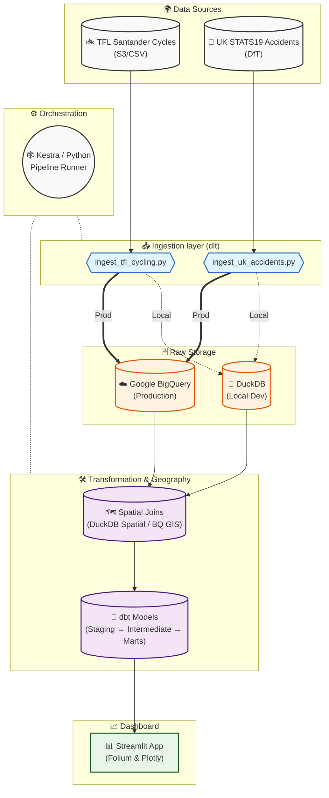

# London Cycling Safety Corridor Analysis

An end-to-end data engineering project that identifies the most dangerous cycling corridors in London by combining TFL Santander Cycle Hire journey data with UK government road accident statistics (STATS19). The pipeline is fully reproducible: clone → configure → run.

---

## Table of Contents

1. [What It Does](#what-it-does)
2. [Architecture](#architecture)
3. [Project Structure](#project-structure)
4. [Prerequisites](#prerequisites)
5. [Option A — Local Run (DuckDB)](#option-a--local-run-duckdb)
6. [Option B — Production (dbt + BigQuery)](#option-b--production-dbt--bigquery)
7. [Option C — Kestra Orchestration (Recommended)](#option-c--kestra-orchestration-recommended)
8. [Dashboard](#dashboard)
9. [Environment Variables Reference](#environment-variables-reference)
10. [Datasets](#datasets)
11. [Technology Stack](#technology-stack)

---

## What It Does

| Analysis | Output |
|---|---|
| **Blackspot scoring** | Every TFL docking station is scored by the number and severity of road accidents within 500 m |
| **Corridor risk ranking** | Common start→end station pairs (corridors) are ranked by accident density along the route |
| **Temporal patterns** | Rush-hour vs. weekend safety, month-by-month seasonality, hour-of-day distribution |

---

## Architecture



---

## Project Structure

```
london-cycling-safety/
├── README.md                        ← you are here
├── requirements.txt                 ← Python dependencies (local dev)
├── .env.example                     ← copy to .env and fill in values
├── run_pipeline.py                  ← single entry-point: ingest → transform → dbt
│
├── Step1_setup.bat                  ← Windows: create .venv, install deps, create .env
├── Step2_run_dev.bat                ← Windows: run local DuckDB pipeline + dashboard
├── Step2_run_prod.bat               ← Windows: run production BigQuery pipeline
│
├── dbt_project.yml                  ← dbt project config
├── profiles.yml                     ← dbt profiles: dev (DuckDB) + prod (BigQuery)
├── packages.yml                     ← dbt package dependencies
│
├── ingestion/
│   ├── ingest_tfl_cycling.py        ← dlt: TFL Santander journeys + stations
│   └── ingest_uk_accidents.py       ← dlt: STATS19 accidents / casualties / vehicles
│
├── transforms/
│   └── spatial_transforms.py        ← DuckDB spatial: blackspot proximity, corridors
│                                       (local dev only — not run in BigQuery mode)
│
├── models/
│   ├── sources.yml                  ← dbt source declarations (schema: raw)
│   ├── staging/
│   │   ├── stg_bike_journeys.sql
│   │   ├── stg_bike_stations.sql
│   │   └── stg_accidents.sql
│   ├── intermediate/
│   │   ├── int_station_blackspot_scores.sql   ← BigQuery GIS + DuckDB branches
│   │   ├── int_corridor_risk.sql              ← BigQuery GIS + DuckDB branches
│   │   └── int_temporal_patterns.sql
│   └── marts/
│       ├── mart_blackspot_analysis.sql
│       ├── mart_corridor_risk.sql
│       └── mart_temporal_safety.sql
│
├── macros/
│   └── classify_time_of_day.sql
│
├── seeds/
│   └── london_boroughs.csv
│
├── orchestration/
│   ├── pipeline.py              ← production orchestrator (BigQuery target)
│   └── schedule_pipeline.py    ← optional weekly scheduler (Mon 03:00)
│
├── kestra/                          ← Kestra orchestration (recommended)
│   ├── docker-compose.yml           ← Kestra + PostgreSQL containers
│   ├── .env                         ← path + GCP variables (not committed)
│   ├── .env.example                 ← template
│   ├── upload_flows.bat             ← POST flows to Kestra API
│   └── flows/
│       ├── 01_full_pipeline.yml     ← weekly production run (Mon 03:00 UTC)
│       ├── 02_backfill.yml          ← manual historical load
│       └── 03_dbt_refresh.yml       ← dbt-only refresh
│
└── dashboard/
    ├── app.py                       ← Streamlit home page
    ├── pages/
    │   ├── 01_blackspot_map.py      ← Folium heatmap of accident blackspots
    │   ├── 02_corridor_risk.py      ← Ranked corridor risk table + map
    │   └── 03_temporal_patterns.py  ← Plotly temporal analysis charts
    └── utils/
        ├── data_loader.py           ← DuckDB query helpers
        └── map_utils.py             ← Folium helper functions
```

---

## Prerequisites

| Requirement | Version | Notes |
|---|---|---|
| Python | ≥ 3.11 | `python --version` |
| uv | any | `pip install uv` or https://docs.astral.sh/uv/ |
| Git | any | to clone the repo |
| Google Cloud account | — | **only** for production / BigQuery option |
| Docker Desktop | any | **only** for Kestra orchestration (Option C) |

---

## Option A — Local Run (DuckDB)

Everything runs on your laptop. No cloud account needed.

### Step 1 — Clone the repo

```bash
git clone https://github.com/sharadgupta27/london-cycling-safety.git
cd london-cycling-safety
```

### Step 2 — Create a Python virtual environment

```bash
# macOS / Linux
uv venv
source .venv/bin/activate

# Windows (PowerShell)
uv venv
.\.venv\Scripts\Activate.ps1
```

### Step 3 — Install Python dependencies

```bash
uv pip install -r requirements.txt
```

### Step 4 — Create your `.env` file

```bash
cp .env.example .env     # macOS / Linux
copy .env.example .env   # Windows
```

The defaults in `.env.example` work without any changes for a local run.

### Step 5 — Run the full pipeline

```bash
python run_pipeline.py
```

> **Windows shortcut — two-step batch workflow:**
>
> 1. Run `Step1_setup.bat` once (after cloning) to create the `.venv`, install dependencies, and create `.env`.
> 2. Then run `Step2_run_dev.bat` to execute the local pipeline and open the Streamlit dashboard.
>
> ```bat
> Step1_setup.bat      :: first-time setup (run once)
> Step2_run_dev.bat    :: ingest + transforms + dbt build + launch dashboard
> ```

This runs in sequence:

1. `ingestion/ingest_tfl_cycling.py` — downloads TFL journey + station data via dlt → `london_cycling.duckdb`
2. `ingestion/ingest_uk_accidents.py` — downloads STATS19 accident data via dlt → `london_cycling.duckdb`
3. `transforms/spatial_transforms.py` — DuckDB spatial extension: proximity scores, corridor geometry
4. `dbt build` — seeds → staging → intermediate → marts models, then data quality tests (all in one command)

**Expected runtime**: 5–15 minutes (depends on download speed).  
**Expected data**: ~6 M TFL journey rows + ~75 K accident rows.

### Step 6 — Launch the dashboard

```bash
streamlit run dashboard/app.py
```

Open **http://localhost:8501** in your browser.

---

### Running individual steps (optional)

```bash
# Ingestion only
python ingestion/ingest_tfl_cycling.py
python ingestion/ingest_uk_accidents.py

# Spatial transforms (DuckDB — not needed for BigQuery mode)
python transforms/spatial_transforms.py

# dbt only (seeds + models + tests in one command)
dbt build --profiles-dir . --project-dir .

# Dashboard only
streamlit run dashboard/app.py --server.port 8501
```

---

## Option B — Production (dbt + BigQuery)

`orchestration/pipeline.py` orchestrates the full pipeline as a plain Python process — ingesting raw data to BigQuery, then running `dbt build` to transform it.

### Step 1 — GCP project setup

1. Go to [console.cloud.google.com](https://console.cloud.google.com) and select (or create) a project.
2. Enable the **BigQuery API**:  
   APIs & Services → Library → search *BigQuery API* → **Enable**
3. Create a **service account**:  
   IAM & Admin → Service Accounts → **Create Service Account**
   - Name: `london-cycling-pipeline` (or any name)
   - Grant two roles: **BigQuery Data Editor** + **BigQuery Job User**
4. Download a **JSON key** for the service account:  
   Service Accounts → your account → **Keys** → Add Key → **JSON**

### Step 2 — Configure `.env` and credentials

1. Copy `.env.example` to `.env` and fill in your GCP values:

   ```dotenv
   GOOGLE_APPLICATION_CREDENTIALS=C:/path/to/credentials/service_account.json
   GCP_PROJECT_ID=your-gcp-project-id
   GCP_BQ_DATASET=dbt_london_cycling
   GCP_BQ_LOCATION=EU
   ```

   > **Windows**: use forward slashes or double back-slashes in the path.

2. Place your downloaded JSON key file at `credentials/service_account.json`  
   (see [credentials/README.md](credentials/README.md) for required IAM roles).

### Step 3 — Install production Python dependencies

```bash
uv pip install -r requirements.txt
```

### Step 4 — Run the production pipeline

```bash
python orchestration/pipeline.py --target prod
```

> **Windows shortcut — two-step batch workflow:**
>
> 1. Run `Step1_setup.bat` once (after cloning) to set up the `.venv` and create `.env`.
> 2. Edit `.env` with your GCP credentials (see Step 2 above).
> 3. Then run `Step2_run_prod.bat` to execute the production pipeline.
>
> ```bat
> Step1_setup.bat          :: first-time setup (run once)
> Step2_run_prod.bat       :: install BigQuery extras, validate credentials, run pipeline
>
> :: Re-run dbt only (skip TFL + STATS19 ingest):
> Step2_run_prod.bat --skip-ingest
> ```

This runs in sequence:

1. **Credential check** — verifies `GOOGLE_APPLICATION_CREDENTIALS` file exists
2. **Ingest TFL cycling data** — dlt → BigQuery (`raw` dataset)
3. **Ingest UK accident data** — dlt → BigQuery (`raw` dataset)
4. **dbt build** — `dbt deps` then `dbt build --target prod`  
   (seeds → staging → intermediate → marts → tests, all in DAG order)

**Expected first-run time**: 10–20 minutes.  
**Expected data**: ~6 M TFL journey rows + ~75 K accident rows.

On success, BigQuery will contain:

| Dataset | Contents |
|---|---|
| `raw` | Raw tables: `tfl_journeys`, `tfl_stations`, `uk_accidents`, `uk_casualties`, `uk_vehicles` |
| `dbt_london_cycling` (or your `GCP_BQ_DATASET`) | `staging.*`, `intermediate.*`, `marts.*` |

### Step 5 — Scheduled runs (optional)

Pick one of three approaches:

**Option 1 - Python scheduler (cross-platform, blocks terminal):**

```bash
# Start the scheduler — runs pipeline every Monday at 03:00 (local time)
python orchestration/schedule_pipeline.py --target prod

# Or run once immediately then exit
python orchestration/schedule_pipeline.py --target prod --run-now

# Or use make
make schedule
```

**Option 2 - Windows Task Scheduler:**

1. `Step2_run_prod.bat` (in the repo root) is the production runner — run `Step1_setup.bat` once first to ensure the venv exists.
2. Open **Task Scheduler** → Create Basic Task → name it `London Cycling Pipeline`
3. Trigger: **Weekly** → Monday → 03:00
4. Action: **Start a program** → point to `Step2_run_prod.bat` in the `london-cycling-safety` folder

**Option 3 - Linux / macOS cron:**

```bash
crontab -e
# Add:
0 3 * * 1 /path/to/.venv/bin/python /path/to/orchestration/pipeline.py --target prod >> /path/to/pipeline.log 2>&1
```

---

### Production pipeline summary

| Step | Script / Command | What it does |
|---|---|---|
| Credential check | `pipeline.py` | Verifies `GOOGLE_APPLICATION_CREDENTIALS` file exists |
| Ingest TFL | `ingest_tfl_cycling.py` | Downloads TFL journey + station CSV → BigQuery `raw` |
| Ingest accidents | `ingest_uk_accidents.py` | Downloads STATS19 data → BigQuery `raw` |
| dbt build | `dbt build --target prod` | Seeds → staging → intermediate → marts + tests in DAG order |

---

## Option 3 - Kestra Orchestration (Recommended)

[Kestra](https://kestra.io) is the recommended way to schedule and monitor the production pipeline.
It replaces `schedule_pipeline.py` / cron / Task Scheduler with a web UI, full run history,
automatic retries, and a dedicated backfill flow.

**Prerequisite:** [Docker Desktop](https://docs.docker.com/desktop/) running.

### Quick start

```bat
cd london-cycling-safety\kestra
docker compose up -d
upload_flows.bat
```

- First boot downloads ~1 GB of images (Kestra + PostgreSQL). Subsequent starts are instant.
- **UI:** http://localhost:8888
- `upload_flows.bat` POSTs the three flow YAMLs from `kestra/flows/` to the Kestra API.

### Available flows

| Flow ID | Schedule | Purpose |
|---|---|---|
| `london_cycling_full_pipeline` | Mon 03:00 UTC (auto) | Weekly production run — ingest TFL + STATS19 → dbt build |
| `london_cycling_backfill` | Manual | Load multiple years of historical data + full dbt rebuild |
| `london_cycling_dbt_refresh` | Manual | Re-run dbt without re-ingesting raw data |

### Trigger a run

1. Open http://localhost:8888 → **Flows** → select a flow
2. Click **Execute** (top-right), adjust inputs as needed, click **Execute** to start
3. Watch real-time logs inside the Kestra UI

For full configuration details (environment variables, Docker runner internals, troubleshooting),
see **[DEPLOYMENT.md §7 — Kestra Orchestration](DEPLOYMENT.md#7-kestra-orchestration-recommended)**.

---

## Dashboard

The Streamlit dashboard reads from the **local DuckDB file** (`london_cycling.duckdb`). Run it after completing the local pipeline (Option A).

```bash
streamlit run dashboard/app.py
```

Open **http://localhost:8501**

| Page | What you see |
|---|---|
| **Home** | Pipeline run status, record counts, last ingestion timestamp |
| **Blackspot Map** | Folium heatmap: TFL stations coloured by risk score, accident markers |
| **Corridor Risk** | Top 20 risky start→end corridors, ranked table, route lines on map |
| **Temporal Patterns** | Rush-hour vs. weekend safety, monthly trends, hour-of-day bar chart |

---

## Environment Variables Reference

All variables go in `.env` (copy from `.env.example`).

| Variable | Default | Description |
|---|---|---|
| `DUCKDB_PATH` | `london_cycling.duckdb` | Path to the local DuckDB database file |
| `TFL_N_FILES` | `12` | Number of TFL weekly CSV files to ingest |
| `ACCIDENT_YEARS` | `2023,2024` | Comma-separated STATS19 years to load |
| `BLACKSPOT_RADIUS_M` | `500` | Accident search radius in metres around each bike station |
| `STREAMLIT_PORT` | `8501` | Streamlit server port |
| `DESTINATION` | `duckdb` | Set to `bigquery` to write raw data to BigQuery instead |
| `GOOGLE_APPLICATION_CREDENTIALS` | *(unset)* | Path to GCP service-account JSON key (BigQuery only) |

---

## Datasets

All data is downloaded fresh on each pipeline run — no large files are stored in this repo.

| Dataset | Source | Rows (approx.) |
|---|---|---|
| TFL Santander Journeys | [cycling.data.tfl.gov.uk](https://cycling.data.tfl.gov.uk/) | ~6 M (12 weekly files) |
| TFL Santander Stations | Embedded in journey CSV | ~800 |
| UK Road Accidents (STATS19) | [data.dft.gov.uk](https://data.dft.gov.uk/road-accidents-safety-data/) | ~75 K (2023–2024) |
| UK Casualties | Same source | ~100 K |
| UK Vehicles | Same source | ~120 K |

---

## Technology Stack

| Layer | Tool | Purpose |
|---|---|---|
| Ingestion | [dlt](https://dlthub.com/) ≥ 0.5 | Schema inference, incremental loads, multi-destination |
| Local warehouse | [DuckDB](https://duckdb.org/) ≥ 1.1 + `spatial` extension | In-process OLAP + geospatial |
| Cloud warehouse | [Google BigQuery](https://cloud.google.com/bigquery) | Production analytics warehouse |
| Transformation | [dbt](https://www.getdbt.com/) ≥ 1.8 | Staging → intermediate → marts, data tests |
| Spatial (local) | DuckDB spatial (`ST_Distance`, `ST_Buffer`, `ST_Within`) | Proximity scoring on laptop |
| Spatial (cloud) | BigQuery GIS (`ST_GEOGPOINT`, `ST_DISTANCE`, `ST_DWITHIN`) | Same logic, BigQuery-native |
| Orchestration | [dbt build](https://docs.getdbt.com/reference/commands/build) + Python + [Kestra](https://kestra.io) | `orchestration/pipeline.py` runs ingestion → `dbt build`; `kestra/` provides web UI scheduling with retries (recommended); `schedule_pipeline.py` available as a fallback |
| Dashboard | [Streamlit](https://streamlit.io/) + [Folium](https://python-visualization.github.io/folium/) + [Plotly](https://plotly.com/) | Interactive maps and charts |
